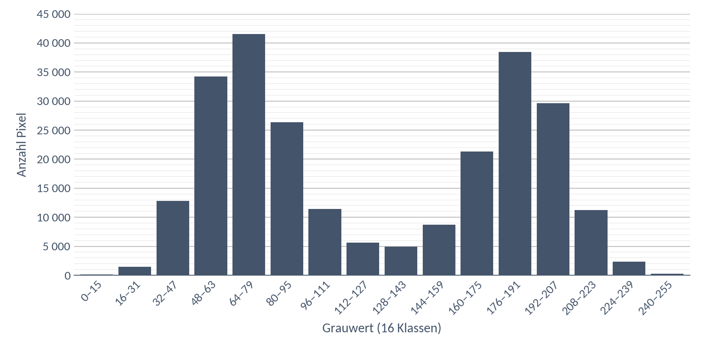

# DS 03 — Hausaufgabe

**Histogramm: Taugt die Aufnahme? · bis Di, 13.10.2026**

---

## Das Histogramm

Von einer Aufnahme eines hellen Bauteils auf dunklem Untergrund wurde das Histogramm gemessen.
Das Bild hat **500 × 500 = 250 000 Pixel**. Die Werte sind zu 16 Klassen zusammengefasst:



Die genauen Zahlen:

| Klasse | Anzahl Pixel | | Klasse | Anzahl Pixel |
|---|---|---|---|---|
| 0 – 15 | 120 | | 128 – 143 | 4 900 |
| 16 – 31 | 1 450 | | 144 – 159 | 8 700 |
| 32 – 47 | 12 800 | | 160 – 175 | 21 300 |
| 48 – 63 | 34 200 | | 176 – 191 | 38 400 |
| 64 – 79 | 41 500 | | 192 – 207 | 29 600 |
| 80 – 95 | 26 300 | | 208 – 223 | 11 200 |
| 96 – 111 | 11 400 | | 224 – 239 | 2 300 |
| 112 – 127 | 5 600 | | 240 – 255 | 230 |

> **Kontrolle:** Die Summe aller 16 Zahlen muss 250 000 ergeben.

---

## a) Ablesen

**Talgrund** (die Klasse mit den wenigsten Pixeln zwischen den Bergen):
… bis …, mit … Pixeln

Linker Berg: Maximum bei …, mit … Pixeln

Rechter Berg: Maximum bei …, mit … Pixeln

---

## b) Schwellwert von Hand wählen

Ihr wollt das Bauteil vom Untergrund trennen: Alles **ab** dem Schwellwert gilt als
Objekt, alles darunter als Untergrund.

Mein Schwellwert:

Begründung — warum gerade dort und nicht 30 Stufen weiter?

---

## c) Wie viele Pixel gehören dann zum Objekt?

Addiert alle Klassen **unterhalb** eures Schwellwerts und zieht die Summe von 250 000 ab.

```
Untergrundpixel:


                                       = __________

Objektpixel:     250 000 - __________  = __________

Anteil am Bild:  __________ / 250 000  = __________ %
```

---

## d) Wie empfindlich ist eure Wahl?

Rechnet dasselbe noch einmal für zwei andere Schwellwerte und tragt ein:

| Schwellwert | Untergrundpixel | Objektpixel | Anteil in % |
|---|---|---|---|
| 112 | | | |
| 128 | | | |
| 144 | | | |
| 160 | | | |

Zwischen welchen zwei benachbarten Schwellwerten ändert sich der Anteil am **wenigsten**?

Von … nach …, nämlich um … Prozentpunkte.

Was sagt euch das über die Stelle, an der ein Schwellwert am besten liegt?

---

## e) Und bei eurer dunklen Aufnahme?

Denkt an das Histogramm eurer eigenen Aufnahme `dunkel` aus dem Unterricht.
Warum ist es dort **schwerer**, einen guten Schwellwert zu finden? Zwei Sätze.

---

**Abgabe:** eure Ergebnisse am 13.10. mitbringen.

**Wozu das gebraucht wird:** DS 04 beginnt damit, dass alle Schwellwerte der Klasse
nebeneinander an die Tafel kommen. Sie werden auseinanderliegen, obwohl alle dasselbe
Histogramm hatten. Daraus entsteht die Frage der Stunde: **Wie entscheidet sich eine
Maschine?** Die Antwort — das Otsu-Verfahren — rechnet genau das aus, was ihr heute mit
dem Auge gemacht habt.
