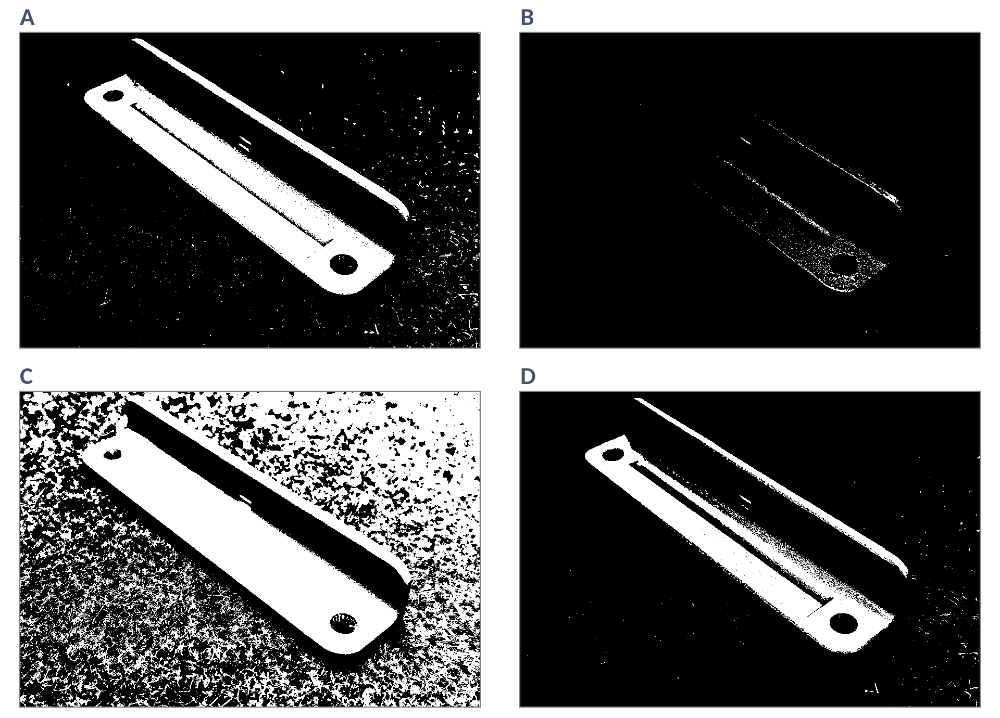
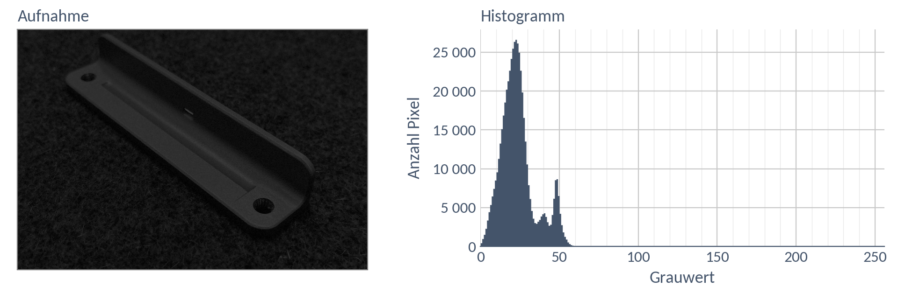

# DS 03 — Hausaufgabe

**Histogramm: Taugt die Aufnahme? · bis Di, 13.10.2026**

---

## Die Aufnahme

Ein helles Bauteil liegt auf einem dunklen Untergrund. Daneben steht das Histogramm der Aufnahme.

---

## a) Ablesen

Das Histogramm hat einen großen Berg und einen kleinen.

Der große Berg reicht etwa von … bis …. Der kleine hat seine Spitze bei etwa ….

Welcher Berg gehört zum Untergrund, welcher zum Bauteil? Woran erkennt ihr das im Bild?

Zwischen den beiden Bergen liegt ein Tal. Es reicht etwa von … bis ….

---

## b) Schwellwert wählen

Ihr wollt das Bauteil vom Untergrund trennen: Alle Pixel **ab** dem Schwellwert werden weiß, alle darunter schwarz.

Mein Schwellwert:

Warum gerade dort?

---

## c) Vier Schwellwerte im Vergleich

Dieselbe Aufnahme, viermal in Schwarz und Weiß geteilt — mit den Schwellwerten **90, 150, 170 und 230**, in anderer Reihenfolge.

Ordnet zu:

| Bild | A | B | C | D |
|---|---|---|---|---|
| Schwellwert | | | | |

Was geht beim Schwellwert 90 schief, was bei 230? Erklärt beides mit dem Histogramm.

Zwei Bilder sehen fast gleich aus. Wo im Histogramm liegen ihre Schwellwerte — und was heißt das für eure Wahl aus b)?

---

## d) Dasselbe Bauteil, dunkel aufgenommen

Was würde euer Schwellwert aus b) aus dieser Aufnahme machen?

Wo müsste der Schwellwert hier liegen?

Warum ist es bei dieser Aufnahme **schwerer**, einen guten Schwellwert zu finden? Zwei Sätze.
